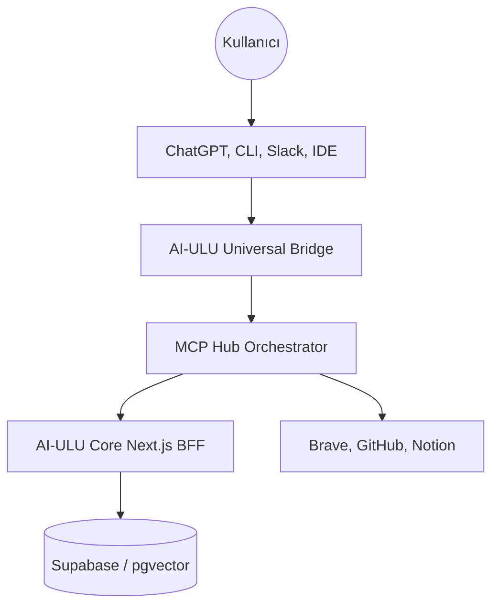

<div align="center">

# 🧠 AI-ULU

**Universal Memory & Context Infrastructure for the Agentic Era**

```
One brain. Every AI. Everywhere.
```

[](https://pypi.org/project/ai-ulu/)
[](LICENSE)
[](docker-compose.yml)
[](ANALYSIS_REPORT.md)

[Technical Specs](ANALYSIS_REPORT.md) · [Prod Checklist](CHECKLIST.md) · [Audit Report](PROD_CHECKLIST_ANALYSIS.md)

</div>

---

## 🚀 Nedir bu AI-ULU?

AI-ULU, yapay zeka uygulamaları için tasarlanmış **evrensel bir hafıza ve bağlam (context) altyapısıdır.** Mevcut çözümlerden farkı, sadece bir vektör veritabanı olması değil, hafızayı zamanla değişen, yaşayan ve duygusal bağlamı olan bir yapı olarak ele almasıdır.

### 🧠 Çekirdek Yenilik: H(x,ψ) Algoritması
AI-ULU'nun kalbinde, hafızayı çağırma önceliğini belirleyen kuantum esintili sezgisel bir puanlama algoritması yatar:
**H(x,ψ,E) = α·S + β·D + γ·I + δ·F + ε·E**

- **Similarity (S):** Semantik benzerlik.
- **Decay (D):** Zamanla solma (Hafıza tazeliği).
- **Importance (I):** Bilginin kritiklik seviyesi (Kimlik > Tercih > Bilgi).
- **Frequency (F):** Kullanım sıklığı.
- **Emotional Resonance (E):** Kullanıcının o anki duygu durumuyla hafızanın uyumu.

---

## ✨ Öne Çıkan Özellikler

- **Universal Bridge:** REST, WebSocket ve MCP (Model Context Protocol) üzerinden her yerden erişim.
- **Write-Intent Guard:** AI'ın her şeyi değil, sadece kullanıcının niyetiyle uyumlu bilgileri kaydetmesini sağlayan akıllı filtre.
- **Enterprise Schema:** Row Level Security (RLS), versiyonlama ve ekip desteği ile kurumsal kullanıma hazır PostgreSQL/pgvector mimarisi.
- **MCP Hub:** Brave Search, GitHub ve Notion gibi dış kaynakları yerel hafıza ile orkestre eden akıllı merkez.
- **Privacy & Safe Mode:** "Gizlilik" moduyla iz bırakmadan çalışma veya "Güvenli" modla sadece okuma yapma imkanı.

---

## 🛠 Mimari Yapı



---

## 🚀 Hızlı Başlangıç

### 1. Self-Hosted Kurulum (Docker)
```bash
git clone https://github.com/agiulucom42-del/emergent-ai-ulu.com
cd emergent-ai-ulu.com
docker-compose up -d
```

### 2. Python SDK & CLI
```bash
pip install ai-ulu

# CLI Kullanımı
export AI_ULU_API_KEY=ulu_full_xxx...
ulu ask "En sevdiğim programlama dili ne?"
ulu remember "Karanlık temayı tercih ederim" --type preference
```

### 3. API Kullanımı
```bash
curl -X POST https://api.ai-ulu.com/v1/query \
  -H "Authorization: Bearer ulu_full_xxx" \
  -d '{"query": "Bugün ne yapmalıyım?"}'
```

---

## 🔑 API Yetkilendirme Katmanları

| Kapsam | İzinler | RPM | Kullanım Alanı |
|-------|---------|-----|----------------|
| `read` | Arama, Sorgulama | 60 | Görüntüleme araçları |
| `write`| + Kaydetme, Güncelleme| 30 | Botlar ve Asistanlar |
| `full` | + Silme, Dışa Aktarma | 100 | CLI ve Ana Uygulamalar |
| `admin`| Tüm Yetkiler | 200 | Panel ve Yönetim |

---

## 📂 Proje Yapısı

- `/frontend`: Next.js tabanlı ana uygulama ve API rotaları.
- `/bridge`: Python FastAPI tabanlı evrensel bağlantı sunucusu.
- `/sdk`: Python ve LangChain entegrasyon paketleri.
- `/bots`: Slack, Discord ve Telegram botları.
- `/mcp-server`: Claude ve Cursor için MCP protokol sunucusu.

---

## 📜 Lisans

MIT © [AI-ULU Team](https://ai-ulu.com)

---

<div align="center">

**Hafıza öncelikli yapay zeka devrimine katılın.**

</div>
